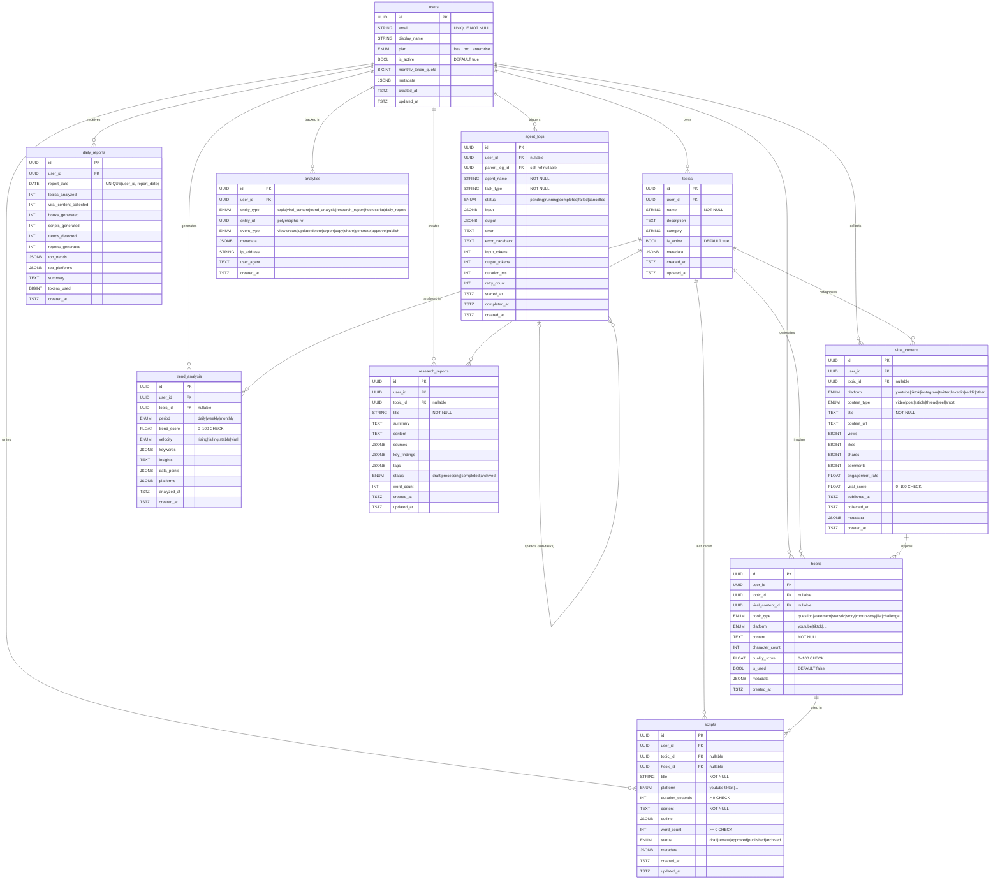

# Entity-Relationship Diagram

> Rendered automatically on GitHub via Mermaid. Open in any Mermaid-compatible viewer.

---

## Index Summary

| Table | Index | Type | Purpose |
|---|---|---|---|
| users | idx_users_email | B-tree | Login lookup |
| users | idx_users_is_active | B-tree | Filter active users |
| users | idx_users_plan | B-tree | Plan-based queries |
| topics | idx_topics_user_id | B-tree | User's topics |
| topics | uq_topics_user_name | Unique | No duplicate names per user |
| viral_content | idx_viral_content_viral_score | B-tree | Sort by virality |
| viral_content | idx_viral_content_user_platform | Composite | Platform filter per user |
| trend_analysis | idx_trend_analysis_velocity | B-tree | Filter rising/viral trends |
| trend_analysis | idx_trend_analysis_user_period | Composite | Period filter per user |
| research_reports | idx_research_reports_active | Partial | Non-archived only |
| hooks | idx_hooks_unused | Partial | Available hooks only |
| hooks | idx_hooks_quality_score | B-tree | Sort by quality |
| scripts | idx_scripts_user_status | Composite | Status filter per user |
| daily_reports | uq_daily_reports_user_date | Unique | One report per user per day |
| agent_logs | idx_agent_logs_failed | Partial | Debug failures fast |
| analytics | idx_analytics_user_entity | Composite | Entity activity per user |
| analytics | idx_analytics_metadata_gin | GIN | JSONB metadata search |

---

## Constraint Summary

| Table | Constraint | Rule |
|---|---|---|
| viral_content | ck_viral_content_viral_score | `0 ≤ viral_score ≤ 100` |
| viral_content | ck_viral_content_views | `views ≥ 0` |
| viral_content | ck_viral_content_likes | `likes ≥ 0` |
| viral_content | ck_viral_content_shares | `shares ≥ 0` |
| viral_content | ck_viral_content_comments | `comments ≥ 0` |
| trend_analysis | ck_trend_analysis_trend_score | `0 ≤ trend_score ≤ 100` |
| hooks | ck_hooks_quality_score | `quality_score IS NULL OR 0–100` |
| scripts | ck_scripts_duration_positive | `duration_seconds IS NULL OR > 0` |
| scripts | ck_scripts_word_count | `word_count IS NULL OR ≥ 0` |
| topics | uq_topics_user_name | `UNIQUE(user_id, name)` |
| daily_reports | uq_daily_reports_user_date | `UNIQUE(user_id, report_date)` |
